# Projeto de Interface

## User Flow

O projeto possui a estrutura de páginas ilustrada no sitemap da figura 1 (a seguir). Além do sitemap, uma visão mais detalhada é apresentada na figura 2, que mostra o fluxo de interação do usuário pelas telas do sistema. Cada uma das telas deste fluxo é detalhada na seção de **Protótipo de baixa fidelidade** que está abaixo.
Para visualizar o protótipo interativo, acesse o [ambiente no figma do projeto](https://www.figma.com/proto/RWJHBPy737PtE1Lvd0dw8O/Grow---Design?node-id=2805-6040&p=f&t=XzLseDVJZP9pUi7c-1&scaling=scale-down&content-scaling=fixed&page-id=2798%3A5997&starting-point-node-id=2805%3A6040&show-proto-sidebar=1) e navegue pelas telas.
<figure>
 
 <figcaptiion>Figura 1 - sitemap</figcaptiion>
</figure>
  
<figure>
 
 <figcaptiion>Figura 2 - wireframes com userflow</figcaptiion>
</figure>

### Orientações
- Para acessar os userflows das diferentes personas **Pai** e **Filhos**, selecione no menu ao lado esquerdo.
  
  <figure> 
  <figcaption>Figura 3 - Menu de seleção de fluxo de usuário
  </figure> 
- Para entender os elementos clicáveis em cada tela, clique em qualquer espaço e eles serão destacados em azul.
  
  <figure> 
  <figcaption>Figura 4 - Exemplo de como os botões são destacados
  </figure> 

## Protótipo de baixa fidelidade
No que tange layout em comum, o projeto possui algumas estruturas que se repetem, são elas:
* Bloco centralizado com o conteúdo de cada página.
  
  <figure> 
  <figcaption>Figura 5 - Padrão do bloco centralizado
  </figure> 
* Em páginas pós login, cabeçalho com logo e botão de logout.
  
  <figure> 
  <figcaption>Figura 6 - Padrão do cabeçalho
  </figure> 
* E na maioria das telas, uma seção resumindo os dados de trajetória do filho, como seu avatar, nível, XP e moedas.
  
  <figure> 
  <figcaption>Figura 7 - Padrão da sessão de trajetória
  </figure> 

### Tela - Login
A tela de login apresenta formulário de login e opção de cadastro

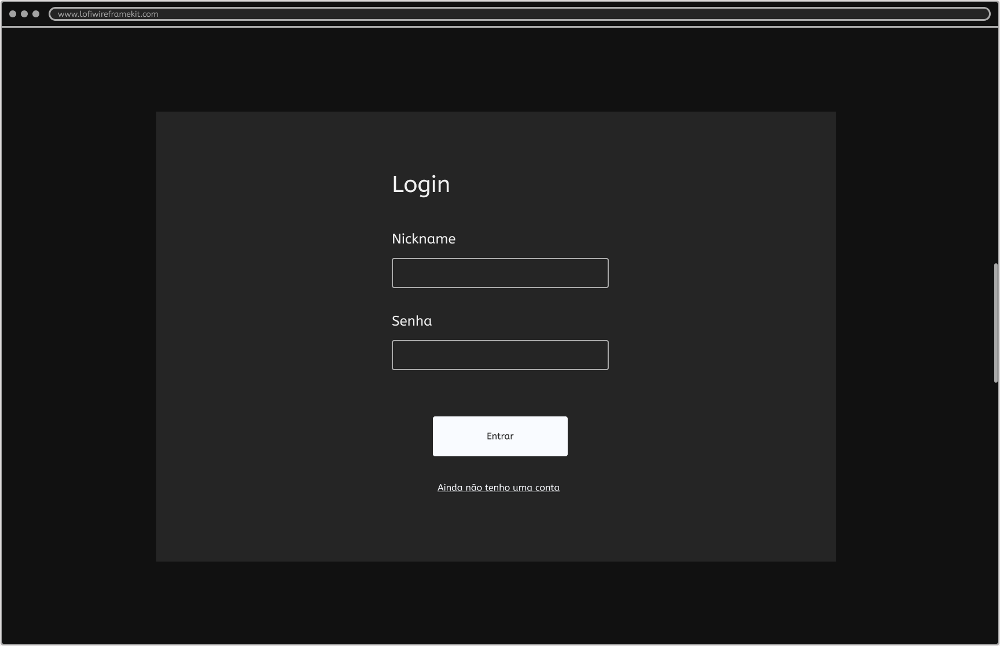

<figure> 
  <figcaption>Figura 8 - Tela de login - prototipada por Caroline Oliveira Neves
</figure> 
   

### Tela - Cadastro
A tela de cadastro apresenta formulário de cadastro com campos de nickname e senha do responsável e filho

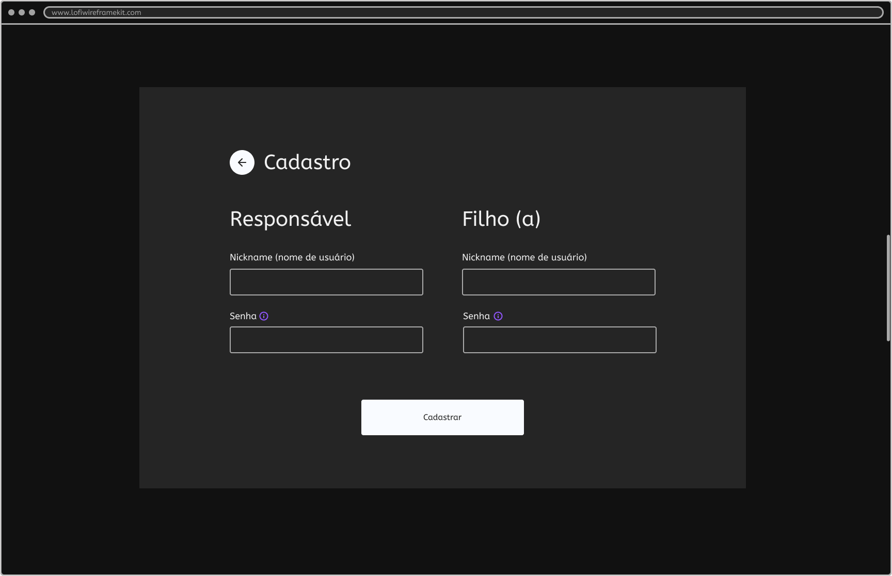
   
<figure> 
  <figcaption>Figura 9 - Tela de cadastro - prototipada por Naiara Andrade Rodrigues de Oliveira
</figure> 
   

### Tela - Home (pais)
A tela de home dos pais apresenta botões com as opções de Metas, Atividades, Prêmio, Aprovações, Penalidades e Trajetória do filho
   
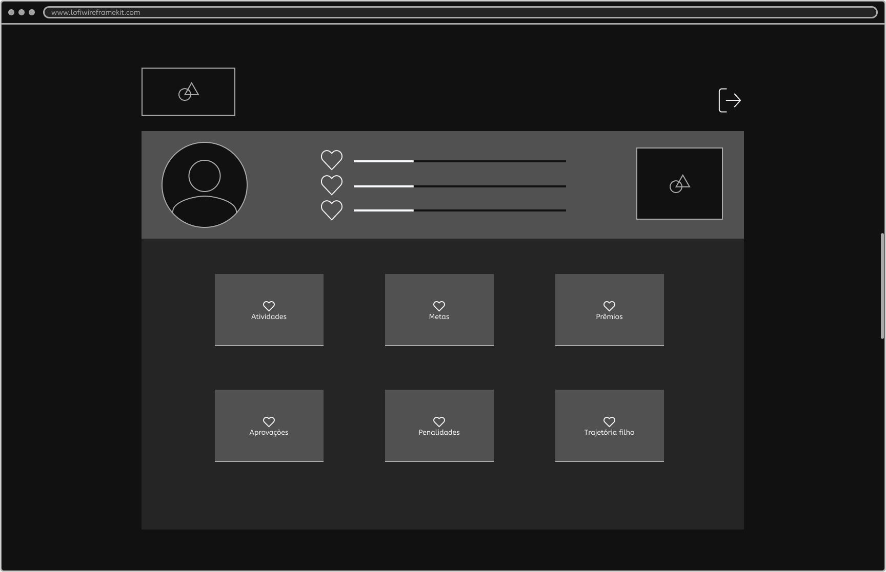

<figure> 
  <figcaption>Figura 10 - Tela de home - prototipada por Amanda Maria Felipe Severo
</figure> 
   

### Tela - Metas
A tela de metas apresenta a lista das metas cadastradas, seus dados e se já foram concluídas, além dos botões de voltar e cadastrar nova meta.

   

<figure> 
  <figcaption>Figura 11 - Tela de metas - prototipada por Amanda Maria Felipe Severo
</figure> 
   

### Tela - Nova meta
A tela de nova meta apresenta o formulário de cadastro de uma nova meta com os campos de titulo, data de início e fim e quantos XPs e moedas a conclusão da meta vai gerar.

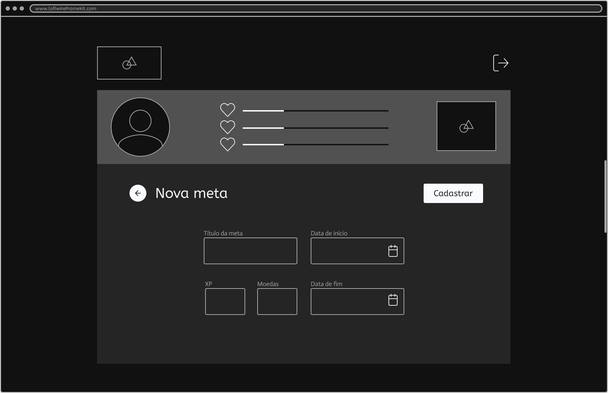

<figure> 
  <figcaption>Figura 12 - Tela de nova meta - prototipada por Amanda Maria Felipe Severo
</figure> 
   

### Tela - Atividades
A tela de atividades apresenta a lista das atividades cadastradas, seus dados e se já foram concluídas, além dos botões de voltar e cadastrar nova atividade.

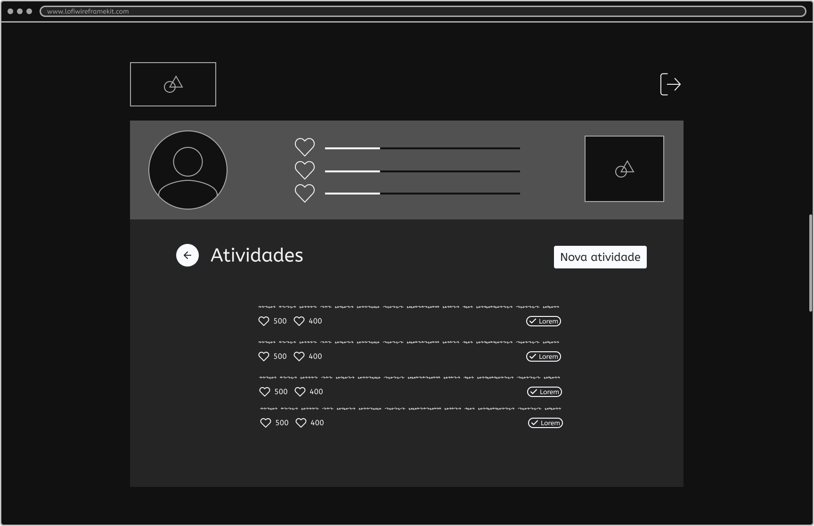   

<figure> 
  <figcaption>Figura 13 - Tela de atividades - prototipada por Edna dos Santos Martins
</figure> 
   

### Tela - Nova atividade
A tela de nova atividade apresenta o formulário de cadastro de uma nova atividade com os campos de titulo, recorrência (diária, semanal, etc) e quantos XPs e moedas a conclusão da atividade vai gerar.
   
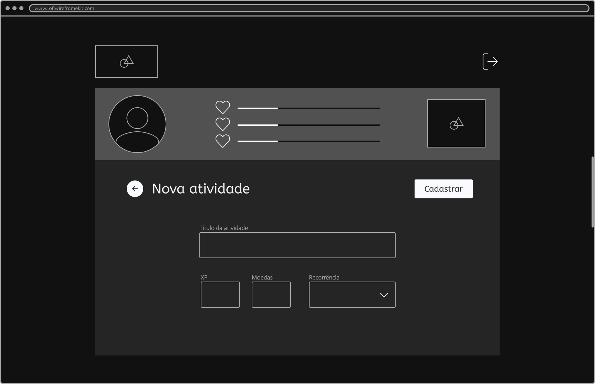

<figure> 
  <figcaption>Figura 14 - Tela de nova atividade - prototipada por Edna dos Santos Martins
</figure> 
   

### Tela - Prêmios
A tela de prêmios apresenta a lista dos prêmios cadastrados, seus dados, progresso e se já foram conquistados, além dos botões de voltar e cadastrar novo prêmio.
  
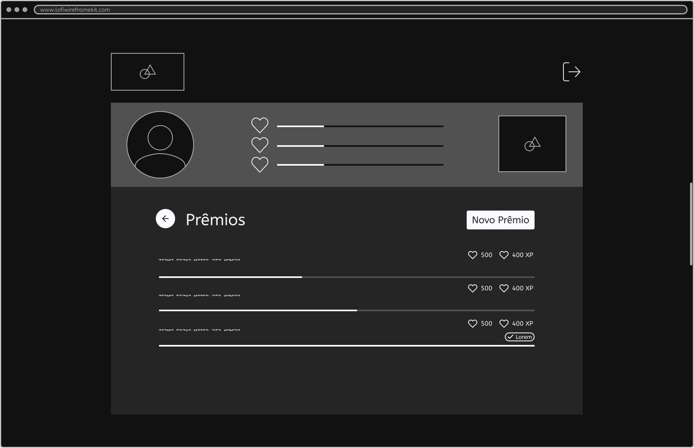

<figure> 
  <figcaption>Figura 15 - Tela de prêmios - prototipada por Fernanda Cunha Silva
</figure> 
   

### Tela - Novo prêmio
A tela de novo prêmio apresenta o formulário de cadastro de um novo prêmio com os campos de titulo e quantos XPs e moedas a conclusão do prêmio vai gerar.

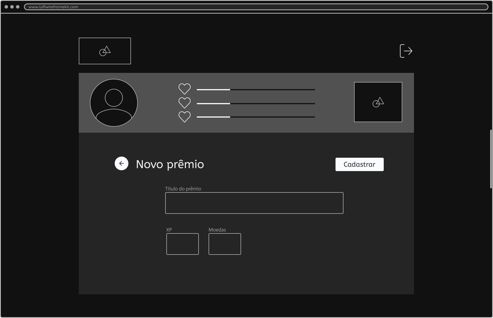
   
<figure> 
  <figcaption>Figura 16 - Tela de novo prêmio - prototipada por Fernanda Cunha Silva
</figure> 
   

### Tela - Aprovações
A tela de aprovações apresenta a lista das atividades e metas concluídas pelo filho, além dos botões para aprovar ou negar a conclusão.

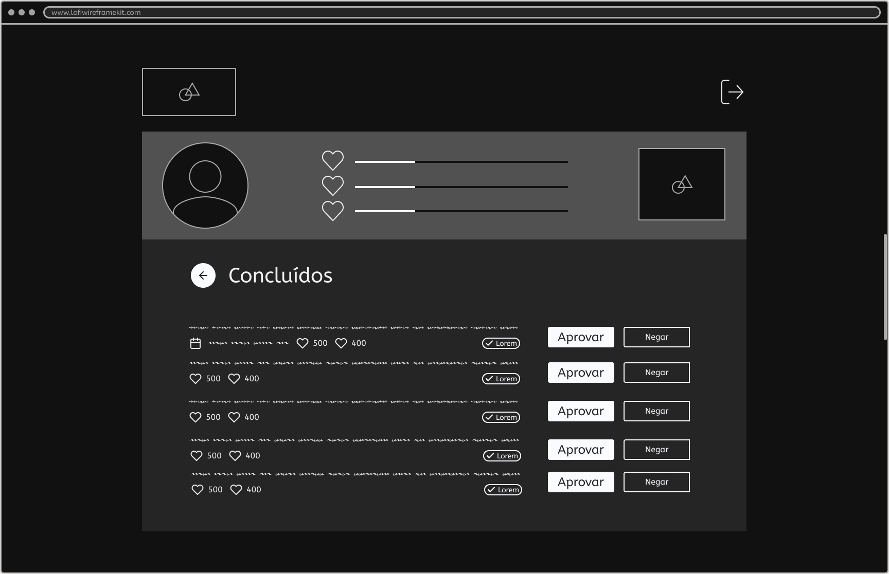

<figure> 
  <figcaption>Figura 17 - Tela de aprovações - prototipada por Rodrigo Andrade da Silva
</figure> 
   

### Tela - Trajetória
A tela de trajetória apresenta o progresso do filho na gamificação, com seu avatar, XP, moedas, nível e prêmios conquistados.

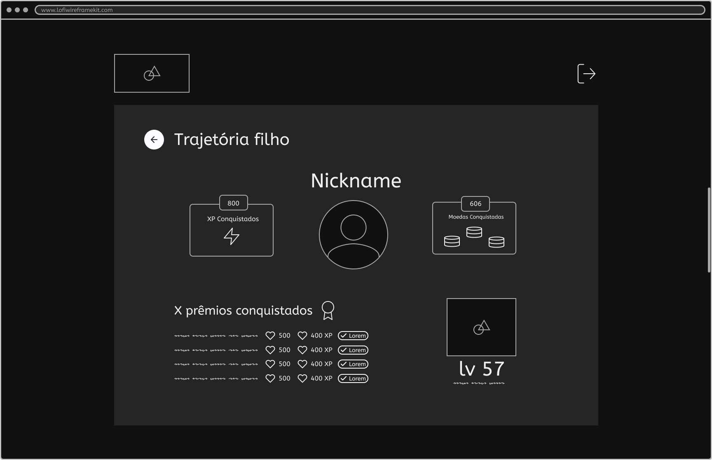

<figure> 
  <figcaption>Figura 18 - Tela de trajetória - prototipada por Edna dos Santos Martins
</figure> 
   

### Tela - Penalidades
A tela de penalidades apresenta a lista das penalidades cadastradas e seus dados, além dos botões de voltar e cadastrar nova penalidade.

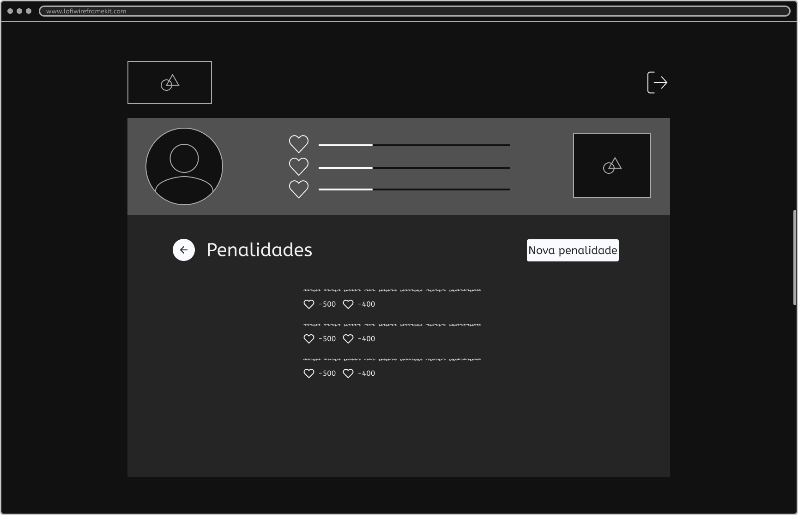

<figure> 
  <figcaption>Figura 19 - Tela de penalidades - prototipada por Rodrigo Andrade da Silva
</figure> 
   

### Tela - Nova penalidade
A tela de nova penalidade apresenta o formulário de cadastro de uma nova penalidade com os campos de titulo e quantos XPs e moedas a aplicação da penalidade vai diminuir do filho.

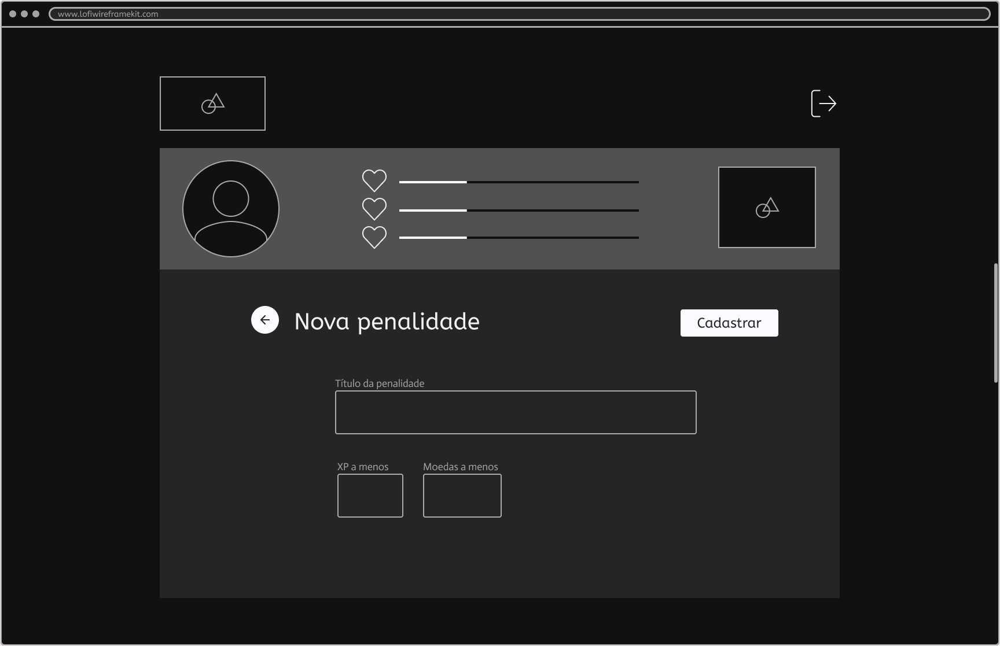

<figure> 
  <figcaption>Figura 20 - Tela de nova penalidade - prototipada por Rodrigo Andrade da Silva
</figure>

### Tela - Home (filhos)
A tela de home dos filhos apresenta a seção com o resumo do progresso, em que é possivel clicar no avatar para modificá-lo, a checklist de atividades e metas a serem realizadas no dia atual, além da barra de navegação para as outras abas de loja e trajetória.

<figure> 
  <figcaption>Figura 21 - Tela de home - prototipada por Amanda Maria Felipe Severo
</figure> 
   

### Tela - Loja
A tela de loja apresenta a lista de prêmios cadastrados, o progresso de XPs até conquistar cada prêmio e quantas moedas vale, além do botão para comprar.

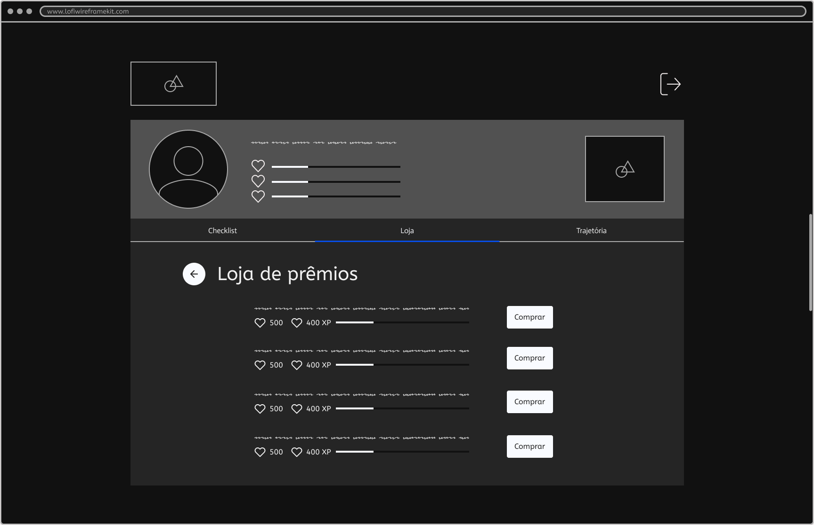

<figure> 
  <figcaption>Figura 22 - Tela de loja - prototipada por Amanda Maria Felipe Severo
</figure>

### Tela - Trajetória
A tela de trajetória apresenta o progresso na gamificação, com seu avatar, XP, moedas, nível e prêmios conquistados. Além de manter a barra de navegação para as outras abas e a opção de voltar.
   
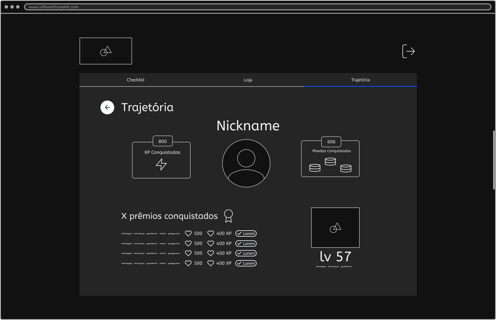

<figure> 
  <figcaption>Figura 23 - Tela de trajetória - prototipada por Edna dos Santos Martins
</figure> 
   

### Tela - Avatar
A tela de avatar apresenta opções de avatar para que o filho escolha com qual se identifica, além do botão para salvar a escolha.

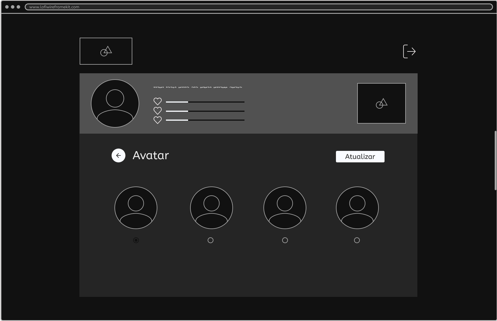

<figure> 
  <figcaption>Figura 24 - Tela de avatar - prototipada por Naiara Andrade Rodrigues de Oliveira
</figure> 
   
### Popups - feedback mapeados
Mapeamos também alguns feedbacks que aparecem no prototipo.

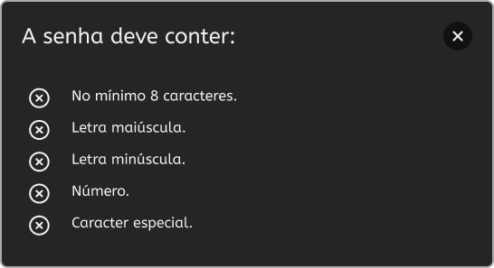

<figure> 
  <figcaption>Figura 25 - Popup de senha - descreve como a senha deve ser
</figure> 

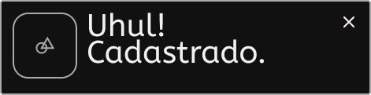

<figure> 
  <figcaption>Figura 26 - Popup de cadastro - alerta cadastro realizado
</figure> 

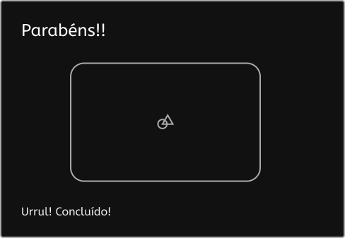

<figure> 
  <figcaption>Figura 27 - Popup de concluído - alerta atividade ou meta concluída
</figure> 

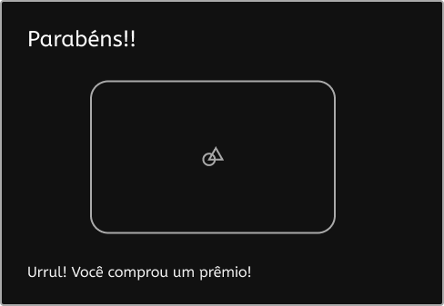

<figure> 
  <figcaption>Figura 28 - Popup de comprado - alerta prêmio comprado
</figure> 