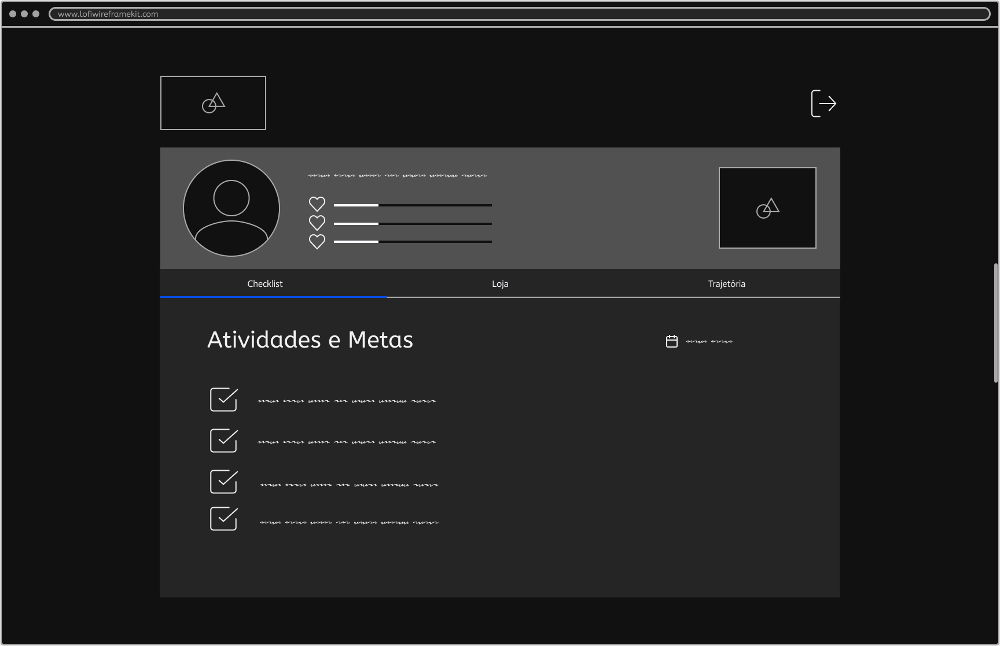
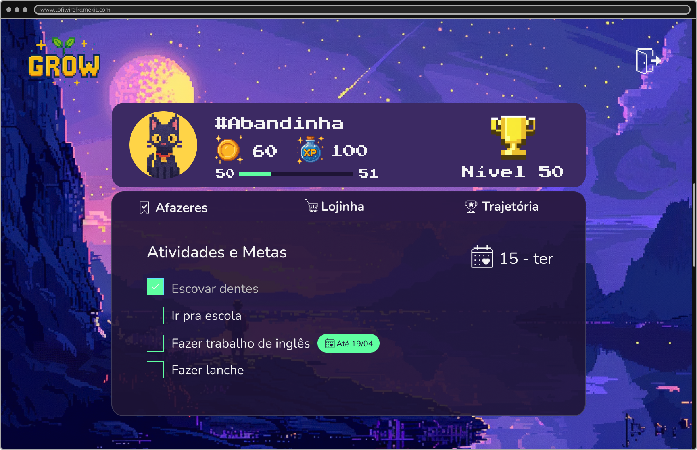

# Template padrão da Aplicação

O layout padrão da aplicação foi desenvolvido inicialmente por meio de protótipos de baixa fidelidade, com foco em simplicidade, utilizando a plataforma **Figma**. As páginas foram projetadas com uma estrutura modular, organizadas em blocos visuais, característica comum aos jogos, garantindo clareza e usabilidade tanto para o público infantil quanto adulto.

As páginas possuem como elementos principais: **cabeçalho**, **barra de status usuário**, **barra de navegação** e **conteúdo central**, sua presença varia de acordo com as telas e/ou tipos de usuário (pai ou filho).

A identidade visual do protótipo possui as seguintes características:
<ul>
<li><b>Cores utilizadas, escalas de preto, branco e cinza:</b> #F4EFEF, #111111, #AAAAAA, #F1F1F1, #252525, #A2A2A2, #F9FBFF, #515151</li>
<li><b>Font-family:</b> ABeeZee e Actor</li>
<li><b>Font-size:</b> 40px para títulos / 16px para conteúdos e botões</li>
</ul>

O código utilizado para a construção dos elementos citados, pode ser consultado [aqui](../codigo-fonte/). As imagens e ícones utilizados no projeto estão disponíveis [aqui](../codigo-fonte/global/imagens/).
A seguir, há dois exemplos visuais das telas do protótipo, que podem ser consultadas em sua totalidade na página [Projeto de Interface](../documentos/04-Projeto%20de%20Interface.md/).

---

### **Tela Home do Filho**
A tela inicial do usuário "filho" apresenta o perfil com indicadores de progresso e um menu com abas (Checklist, Loja e Trajetória).  
É por meio dela que o usuário acessa e marca suas tarefas como concluídas.

<figure> 
  
  <figcaption><b>Figura 1</b> – Tela inicial da conta do filho</figcaption>
</figure>

---

### **Tela Home do Pai**
Na tela inicial do usuário "pai", há uma estrutura de navegação em blocos, permitindo acessar áreas como Atividades, Metas, Prêmios, Penalidades e Acompanhamento da Trajetória do Filho.  
Essa tela centraliza o gerenciamento das ações de recompensa, aprovação e visualização do progresso.

<figure> 
  
  <figcaption><b>Figura 2</b> – Tela inicial da conta do pai</figcaption>
</figure>

---
### Logotipo
Para a criação do logotipo do site foram utilizadas principalmente as cores amarelo e verde, que evocam sensações de energia e crescimento. O conteúdo carrega o nome da plataforma em uma tipografia _pixelada_, geralmente associada a jogos, uma planta em crescimento representando o desenvolvimento infantil, além dos brilhos ao redor trazendo a ideia de magia, que é o tema geral.
<figure> 
  
  <figcaption><b>Figura 3</b> – Logotipo da aplicação Grow</figcaption>
</figure>

---
## Design oficial

Tendo como base os protótipos, também foi criada uma interface definitiva, com a identidade visual condizente aos objetivos da aplicação.
A página de estilos com toda a documentação pode ser visualizada no [Figma](https://www.figma.com/design/RWJHBPy737PtE1Lvd0dw8O/Grow---Design?node-id=758-1&t=cimOuaDvm8L2U6K7-1) e as principais características estão descritas abaixo.

### Tipografia
* Font-family: Nunito
 Muito usada em apps educacionais, boa legibilidade e toque humano.
 - Font-size: 32px para textos grande / 24px para textos médios / 16px para textos pequenos.
* Font-family: Press Start 2P
 Fonte clássica do NES (Nintendo), ideal para passar a ideia de jogo.
 - Font-size: 24px para textos grande / 16px para textos médios.

### Paleta de cores

🌌 Paleta GROW – Dark com Roxo Mágico e Destaques Vivos

🟣 Base Escura com Roxo
- Roxo profundo (fundo primário): #1E1435
- Roxo-acinzentado (fundo secundário): #2C1B47
- Lilás escuro (fundo terciário): #3C2A63

🌈 Cores de Destaque Vivas (Gamificação e Infância)
- Amarelo-magia: #FFD447
- Verde-sprout: #5FFFA1
- Rosa-pixel: #FF66C4
- Azul-celeste: #5EDFFF
- Laranja-diversão: #FF914D

⚪ Neutros - textos
- Texto principal: #F4F4F4
- Texto secundário: #BEBEBE
- Traços: #44405A

As cores que mais recebem destaque são amarelo, roxo e verde, essa escolha foi fundamentada em princípios acadêmicos: o amarelo para promover alegria e engajamento mental, o verde para simbolizar crescimento saudável e estabilidade emocional, e o roxo para evocar criatividade, imaginação e a atmosfera mágica que define a experiência gamificada da plataforma.

> “The color yellow is associated with happiness, optimism, and energy. It stimulates mental activity and generates muscle energy, making it ideal for attention and memory tasks.”  (Satyendra Singh, 2006)  
> “Green symbolizes growth, harmony, and freshness. It is strongly associated with safety and tranquility in color psychology.”  (Kurt Nassau, 2001)  
> “Purple combines the calm stability of blue and the fierce energy of red. It is associated with imagination, spirituality, and magic.”  (Angela Wright, 1995)  

### Exemplo ilustrado
A seguir, imagem com o protótipo de alta fidelidade, contendo o design de modo geral, ícones e imagem de fundo.
<figure> 
  
  <figcaption><b>Figura 4</b> – Protótipo de alta fidelidade</figcaption>
</figure>
