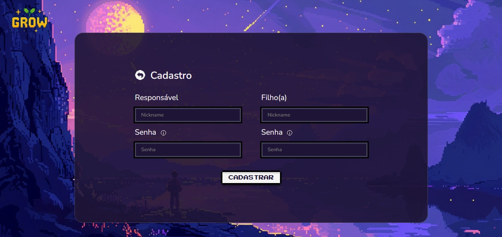
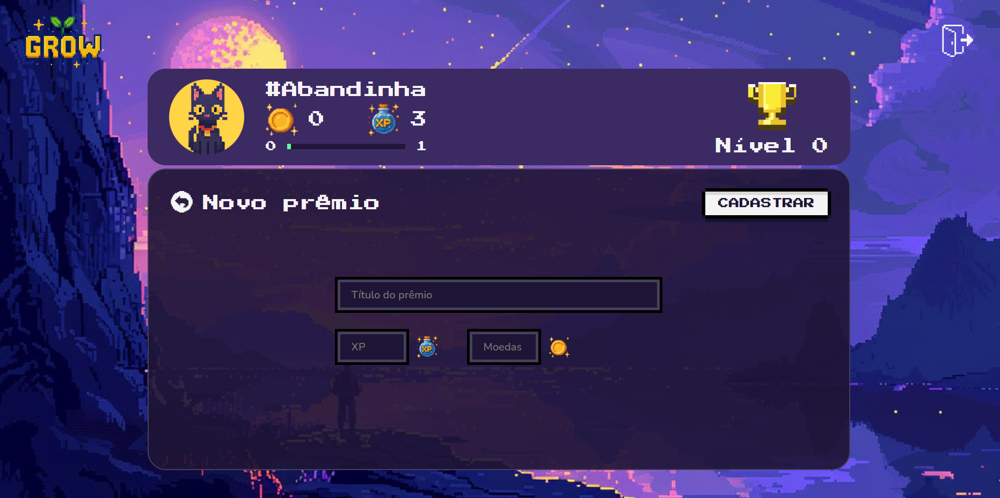
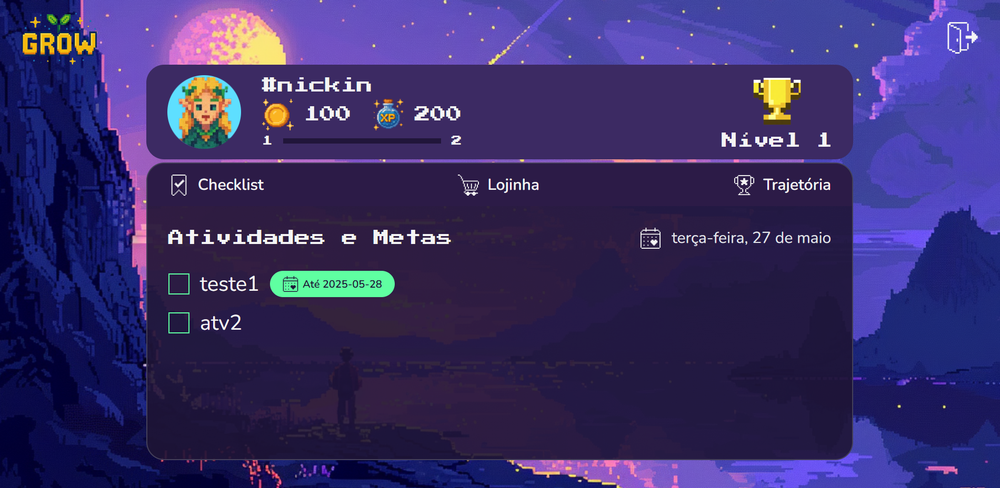
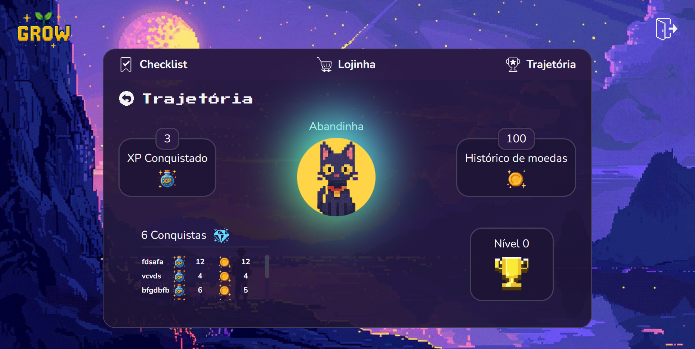

# Programação de Funcionalidades

### Tela de Login (RF-01)

#### Requisito atendido 

RF-01: O site deve permitir ao usuário fazer o login da sua conta.

#### Artefatos da funcionalidade

- login.html
- login.css
- login.js

#### Instruções de acesso

1.	Abra um navegador de Internet e informe a seguinte URL:https://icei-puc-minas-pmv-ads.github.io/pmv-ads-2025-1-e1-proj-web-t3-v2-grow/codigo-fonte/pagina-login/login.html
2.	Preencha as credenciais de acesso (usuário e senha) e clique em "Entrar".
   
#### Responsável
Naiara Andrade Rodrigues de Oliveira

---

### Tela de Cadastro (RF-02)

#### Requisitos atendidos 

RF-02: Permitir que pais ou responsáveis cadastrem sua conta e a de seus filhos.

#### Artefatos da funcionalidade

- pagina-de-cadastro.html
- pagina-de-cadastro.css
- pagina-de-cadastro.js

#### Instrução de acesso

1.	Abra um navegador de Internet e informe a seguinte URL:https://icei-puc-minas-pmv-ads.github.io/pmv-ads-2025-1-e1-proj-web-t3-v2-grow/codigo-fonte/pagina-login/login.html
2. Ao clicar em “Cadastre-se” no canto inferior central da tela, terá acesso a página de cadastro.

#### Responsável 
Fernanda Cunha Silva

---

### Tela de Cadastro de Metas (RF-04)

#### Requisitos atendidos 

RF-02: Permitir que pais ou responsáveis cadastrem metas e estipulem prazos.

#### Artefatos da funcionalidade

- pagina-de-cadastro.html
- pagina-de-cadastro.css
- pagina-de-cadastro.js

#### Instrução de acesso
-

### Tela Lista de Prêmios (RF-05)

#### Requisito atendido

RF-05:	Possibilitar que os pais vejam as bonificações para cada estágio alcançado.

#### Artefatos da funcionalidade

- premios.css
- premios.js
- premios.html

#### Instruções de acesso

1. Faça **login** através da página disponivel no link URL:https://icei-puc-minas-pmv-ads.github.io/pmv-ads-2025-1-e1-proj-web-t3-v2-grow/codigo-fonte/pagina-login/login.html com um usuário do tipo **responsável**.
2. Clique em "Prêmios".
3. A tela de prêmios será exibida e, se houver prêmios cadastrados, a lista poderá ser vista.

#### Responsável: 

Edna dos Santos Martins

---

### Tela de Cadastro de Prêmios (RF-05)

#### Requisito atendido

RF-05: Possibilitar que os pais definam bonificações para cada estágio alcançado.

#### Artefatos da funcionalidade

- novo-premio.css
- novo-premio.js
- novo-premio.html

#### Instruções de acesso

1. Faça **login** através da página disponivel no link URL:https://icei-puc-minas-pmv-ads.github.io/pmv-ads-2025-1-e1-proj-web-t3-v2-grow/codigo-fonte/pagina-login/login.html com um usuário do tipo **responsável**.
2. Clique em "Prêmios" > "Novo prêmio".
3. A tela de cadastro será exibida.
4. Preencha os campos obrigatórios:
   - Nome do prêmio
   - Pontuação necessária (XP)
   - Moedas necessárias
5. Clique em "Cadastrar" para registrar o prêmio. A seguir, irá automaticamente para a lista de prêmios.

#### Responsável: 

Edna dos Santos Martins

---

### Tela de Aprovações (RF-06)

 

#### Requisito atendido 

RF-06: Exibir atividades finalizadas para aprovação do pai ou dos responsáveis.

#### Artefatos da funcionalidade

- mock-aprovacoes.js
- pagina-aprovacoes.css
- pagina-aprovacoes.js
- pagina-aprovacoes.html

#### Instruções de acesso

1.	Abra um navegador de Internet e informe a seguinte URL:https://icei-puc-minas-pmv-ads.github.io/pmv-ads-2025-1-e1-proj-web-t3-v2-grow/codigo-fonte/pagina-aprovacoes/pagina-aprovacoes.html
2.	A lista de atividades pendentes será exibida automaticamente, com base nos dados armazenados no navegador (localStorage).
3. Clique em "Aprovar" ou "Negar" para avaliar cada atividade.

#### Responsável
Rodrigo Andrade da Silva

---

### Tela de Checklist (RF-08)

#### Requisito atendido 

RF-08: Disponibilizar um checklist para gerenciar tarefas e metas, permitindo marcar itens como concluídos ou não.

#### Artefatos da funcionalidade

- pagina-checklist.html
- pagina-checklist.css
- pagina-checklist.js

#### Instruções de acesso

1.	Abra um navegador de Internet e informe a seguinte URL:https://icei-puc-minas-pmv-ads.github.io/pmv-ads-2025-1-e1-proj-web-t3-v2-grow/codigo-fonte/pagina-login/login.html
2.	Preencha as credenciais de acesso (usuário e senha) de um usuário do tipo **filho** e clique em "Entrar".
3. A página deverá aparecer com as atividades e metas do dia, ou em branco caso não haja nenhuma.
   
#### Responsável
Amanda Maria Felipe Severo

---

### Tela de Trajetória (RF-09)

#### Requisito atendido 

RF-09: Visualizar trajetória e recompensas conquistadas

#### Artefatos da funcionalidade

- trajetoria.html
- trajetoria.css
- trajetoria.js

#### Instruções de acesso

1.	Abra um navegador de Internet e informe a seguinte URL:https://icei-puc-minas-pmv-ads.github.io/pmv-ads-2025-1-e1-proj-web-t3-v2-grow/codigo-fonte/pagina-login/login.html
2.	Preencha as credenciais de acesso (usuário e senha) e clique em "Entrar".
3. Clique em "trajetória". A página deverá aparecer com a trajetória e recompensas conquistadas, com ou sem a lista de conquistas.
4. A trajetória já poderá ser observada na página, e para ver a atualização é necessário concluir uma tarefa do checklist e também que ela seja aprovada pelo responsável.
5. Após o processo de aprovação, quando a página for recarregada, a trajetória irá atualizar.
   
#### Responsável
Edna dos Santos Martins

---

### Contabilização de progresso (RF-10)

Esse requisito não se trata de uma tela, mas sim de um conjunto de processos nos quais os dados de progresso (moedas, xp e nível) são salvos e disponibilizados para visualização.

#### Requisito atendido 

RF-10: Contabilizar moedas e/ou experiência (XP) ao completar uma tarefa.

#### Artefatos da funcionalidade

- pagina-checklist.js
- pagina-aprovacoes.js *(funções específicas)*
- barra-status.html
- barra-status.css
- barra-status.js

#### Instruções de acesso

1.	Abra um navegador de Internet e informe a seguinte URL:https://icei-puc-minas-pmv-ads.github.io/pmv-ads-2025-1-e1-proj-web-t3-v2-grow/codigo-fonte/pagina-login/login.html
2.	Preencha as credenciais de acesso (usuário e senha) de um usuário do tipo **filho** e clique em "Entrar".
3. A página deverá aparecer com as atividades e metas do dia, ou em branco caso não haja nenhuma.
4. O requisito já poderá ser observado na barra de status do usuário na página, para ver a atualização é necessário concluir uma tarefa do checklist e também que ela seja aprovada pelo responsável.
5. Após o processo de aprovação, quando a página for recarregada, o progresso da barra irá atualizar.
   
#### Responsável
Amanda Maria Felipe Severo

---

### Tela de Escolha de Avatar (RF-12)

#### Requisito atendido

RF-12: Possibilitar a escolha de um avatar.

#### Artefatos da funcionalidade
- pagina-avatar.html
- pagina-avatar.css
- pagina-avatar.js

#### Instruções de acesso
1. Abra um navegador de Internet e informe a seguinte URL: https://icei-puc-minas-pmv-ads.github.io/pmv-ads-2025-1-e1-proj-web-t3-v2-grow/codigo-fonte/pagina-avatar/pagina-avatar.html
2. Uma interface será aberta exibindo as opções disponíveis de avatares.  
3. Clique sobre o avatar desejado para selecioná-lo.  
4. Para atualizar seu avatar clique no botão **"atualizar"**  

#### Responsável

Caroline Oliveira Neves

---
