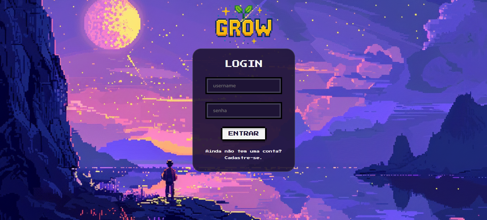
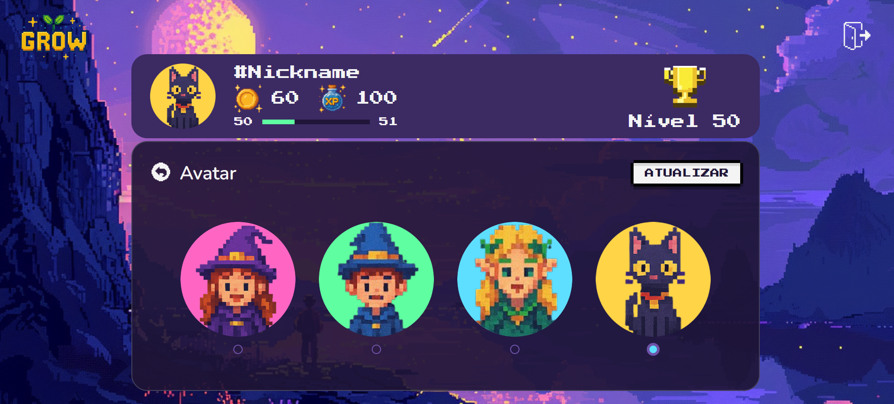

# Programação de Funcionalidades

### Tela de Login (RF-001)

#### Requisito atendido 

RF-001: O site deve permitir ao usuário fazer o login da sua conta.

#### Artefatos da funcionalidade

- login.html
- login.css
- login.js

#### Instruções de acesso

1.	Abra um navegador de Internet e informe a seguinte URL:https://icei-puc-minas-pmv-ads.github.io/pmv-ads-2025-1-e1-proj-web-t3-v2-grow/codigo-fonte/pagina-login/login.html
2.	Preencha as credenciais de acesso (usuário e senha) e clique em "Entrar".
   
#### Responsável
Naiara Andrade Rodrigues de Oliveira

### Tela de Cadastro (RF-02)

RF-02: A tela de cadastro poderá ser acessada através da opção “Cadastre-se”. 

### Requisitos atendidos 

**RF-02: A aplicação deve permitir que o pai/responsável cadastre a sua conta e a de seus filhos

### Artefatos da funcionalidade

### Estrutura de Dados

#Instrução de acesso

1.Abra um navegador de Internet e informe a seguinte URL:https://icei-puc-minas-pmv-ads.github.io/pmv-ads-2025-1-e1-proj-web-t3-v2-grow/codigo-fonte/pagina-de-cadastro/pagina-de-cadastro.html

### Responsável: Fernanda

### Tela de cadastro de prêmios (RF-005)

O cadastro de prêmios com nome, descrição e pontuação poderá ser feito após o login do usuário.

[Adicione imagem da funcionalidade/tela]

#### Requisito atendido

RF-05:	Possibilitar que os pais definam bonificações para cada estágio alcançado.

#### Artefatos da funcionalidade

[Adicione os nomes dos arquivos relacionados ao desenvolvimento da funcionalidade]

#### Estrutura de Dados

As estruturas de dados foram baseadas em HTML, CSS e JS.

#### Instruções de acesso

1. Faça **login** através da página disponivel no link [ ] .
2. Clique em **"Pai" > "Prêmios" > "Cadastrar Prêmio"**.
3. A tela de cadastro será exibida.
4. Preencha os campos obrigatórios:
   - Nome do prêmio
   - Descrição
   - Pontuação necessária
5. Clique em **"Salvar"** para registrar o prêmio.
6. A conclusão do prêmio vai gerar.

#### Responsável: 

Edna Martins

### Tela de Aprovações (RF-006)

 

#### Requisito atendido 

RF-006: Exibir atividades finalizadas para aprovação do pai ou dos responsáveis.

#### Artefatos da funcionalidade

- mock-aprovacoes.html
- pagina-aprovacoes.css
- pagina-aprovacoes.js
- pagina-aprovacoes.html

#### Instruções de acesso

1.	Abra um navegador de Internet e informe a seguinte URL:https://icei-puc-minas-pmv-ads.github.io/pmv-ads-2025-1-e1-proj-web-t3-v2-grow/codigo-fonte/pagina-aprovacoes/pagina-aprovacoes.html
2.	A lista de atividades pendentes será exibida automaticamente, com base nos dados armazenados no navegador (localStorage).
3. Clique em "Aprovar" ou "Negar" para avaliar cada atividade.

#### Responsável
Rodrigo Andrade da Silva

### Escolha de Avatar (RF-12)

#### Requisito atendido

**RF-12**: Possibilitar a escolha de um avatar.

#### Artefatos da funcionalidade
- pagina-avatar.html
- pagina-avatar.css
- pagina-avatar.js
#### Instruções de acesso
1. Abra um navegador de Internet e informe a seguinte URL: https://icei-puc-minas-pmv-ads.github.io/pmv-ads-2025-1-e1-proj-web-t3-v2-grow/codigo-fonte/pagina-avatar/pagina-avatar.html
2. Uma interface será aberta exibindo as opções disponíveis de avatares.  
3. Clique sobre o avatar desejado para selecioná-lo.  
4. Para atualizar seu avatar clique no botão **"atualizar"**  

#### Responsável

**Caroline Oliveira Neves**

> **Links Úteis**:
> - [Trabalhando com HTML5 Local Storage e JSON](https://www.devmedia.com.br/trabalhando-com-html5-local-storage-e-json/29045)
> - [JSON Tutorial](https://www.w3resource.com/JSON)
> - [JSON - Introduction (W3Schools)](https://www.w3schools.com/js/js_json_intro.asp)
> - [JSON Tutorial (TutorialsPoint)](https://www.tutorialspoint.com/json/index.htm)

