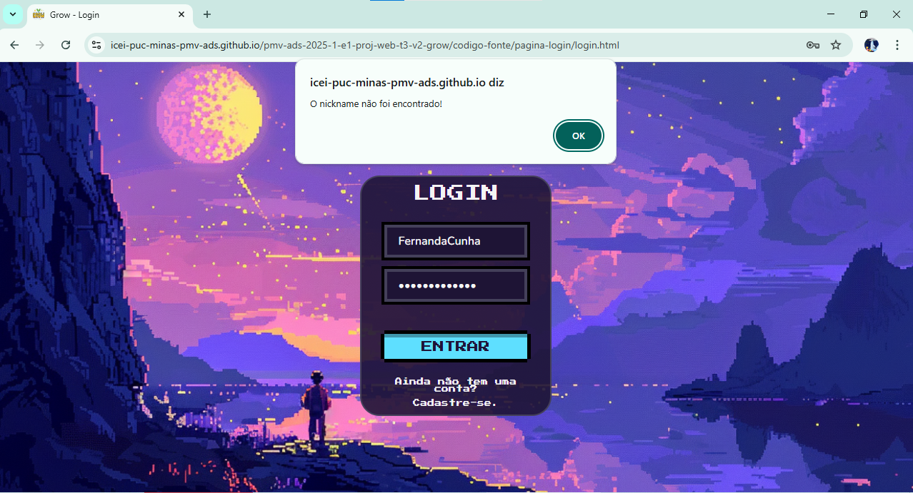
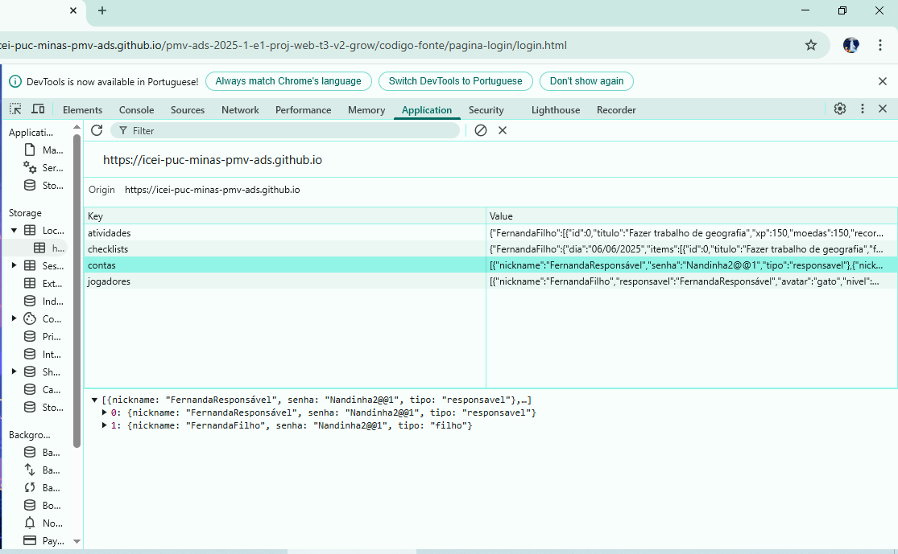
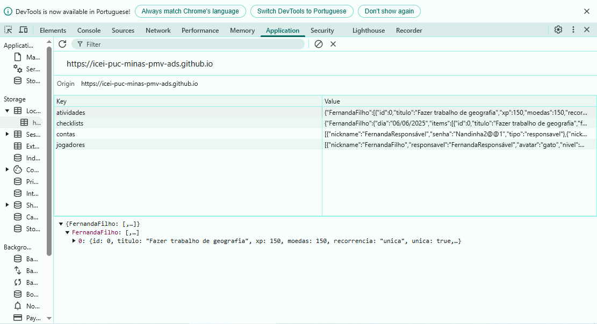

# Registro de Testes de Software

Pré-requisitos: <a href="./04-Projeto de Interface.md"> Projeto de Interface</a>, <a href="./07-Plano de Testes de Software.md"> Plano de Testes de Software</a>

Os testes funcionais realizados na aplicação web são descritos a seguir.

<ol>
  <li>
  CT-01: Escolha de avatar

  Responsável: Amanda.

  <video controls>
    <source src="./videos/registro-ct01.mp4" type="video/mp4">
  </video>

  [Visualização GitHub](https://github.com/user-attachments/assets/15273d5e-c395-4d14-b97b-3591b5e0e28c)

  </li>

  

  
  <li>
  CT-02: Cadastro de penalidade

  Responsável: Amanda.

  <video controls>
    <source src="./videos/registro-ct02.mp4" type="video/mp4">
  </video>

  [Visualização GitHub](https://github.com/user-attachments/assets/b121b311-265b-41b7-b67b-b2e9656c209d)

  </li>

  

  
  <li>
  CT-03: Verificar o cadastro de recompensas

  Responsável: Caroline

  <video controls>
    <source src="./videos/registro-ct02.mp4" type="video/mp4">
  </video>

  https://github.com/user-attachments/assets/6d2aa832-a4e9-4153-8546-eed3527a40ab

  </li>

  

  
  <li>
CT-04: Verificar a tela trajetória e recompensas conquistadas

  Responsável: Caroline

  https://github.com/user-attachments/assets/5f7c0746-b40d-4332-a056-add6607c7e33

  </li>

  

  
  <li>
  CT-05: Verificar a conclusão de tarefas

  Responsável: Rodrigo.

  <video controls>
    <source src="./videos/registro-ct05.mp4" type="video/mp4">
  </video>

 [Visualização GitHub](https://github.com/user-attachments/assets/52622091-f73c-4ec4-bcfe-30b5e6d4b617) 

  </li>

  

  
  <li>
  CT-06: --

  Responsável: --.

  [Evidência]

  </li>

  

  
  <li>
  CT-07: Utilizar a loja de prêmios

  Responsável: Naiara.

  <video controls>
    <source src="./videos/registro-ct01.mp4" type="video/mp4">
  </video>

  https://github.com/user-attachments/assets/057e0dd6-742f-457c-a8b2-076771305fa8

  </li>

  

  
<li>
  CT-08: Login do usuário

  Responsável: Fernanda.

Usuário preenche os campos "Nickname" e "Senha", se as informações de usuário forem válidas, o login será bem sucedido..

<video controls>
  <source src="./videos/registro-ct08.mp4" type="video/mp4">
</video>
  
  https://github.com/user-attachments/assets/7b9bd6b5-3dcc-42e2-b123-9ab70fd917cb

  
 Informações de login inválidas.

  
<figure>
 
 <figcaptiion>Figura- Login inválido</figcaptiion>
</figure>

 Informações armazenadas no LocalStorage.

<figure>
 
 <figcaptiion>Figura- LocalStorage login</figcaptiion>
</figure>

  </li>

  

  <li>
  CT-09: Cadastro de atividade

  Responsável: Fernanda.

Usuário preenche os campos "Título de atividades", "XP", "Moedas", "Recorrência" e "Dia da semana".

  <video controls>
  <source src="./videos/registro-ct09.mp4" type="video/mp4">
  </video>
    
  https://github.com/user-attachments/assets/97e9e786-28cf-4c85-8575-8da86a582ea1

Campos sem preenchimento> 

<figure>
 
 <figcaptiion>Figura- LocalStorage cadastro de atividades</figcaptiion>
</figure>

 Informações armazenadas no LocalStorage.
>

<figure>
 
 <figcaptiion>Figura- LocalStorage cadastro de atividades</figcaptiion>
</figure>

  </li>

  

  <li>
  

  <li>
  CT-10: --

  Responsável: --.

  [Evidência]

  </li>

  

  <li>
  CT-11: --

  Responsável: --.

  [Evidência]

  </li>

  

  <li>
  CT-12: --

  Responsável: --.

  [Evidência]

  </li>
</ol>
    

## Avaliação

Os testes de software mostraram que os requisitos priorizados foram atendidos, funcionando como planejado. Para as próximas iterações, serão acrescentadas melhorias na atualização de informações sem necessidade de recarregamento e responsividade da aplicação, além dos outros requisitos não funcionais.
